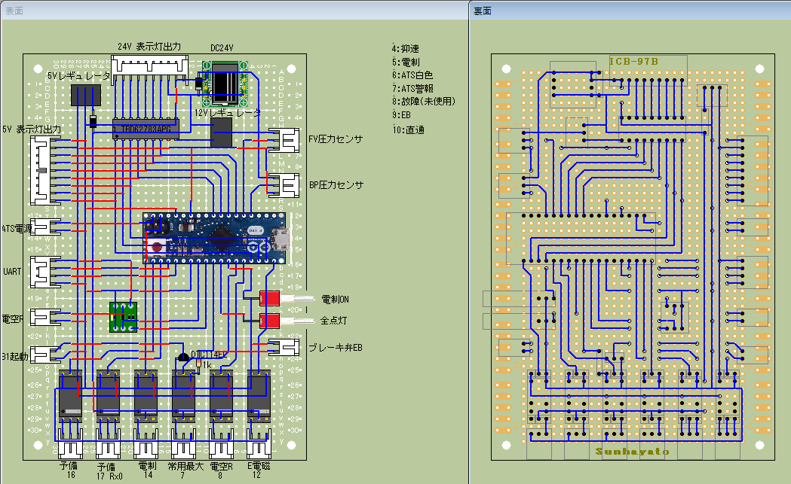

## 表示灯、バルブ制御、自動帯制御用

- 上位の基板とはRx <- Tx 、 Tx -> Rx　で接続をとります
- 圧力センサは0～500kPaの範囲をカバーするもので0～5V以内の出力が出るものを選定してください
- 電空レギュレータも0～500kPa出力を0～5Vで行えるもの、電源はDC24Vを選定してください
- 表示灯は5/12/24V対応としていますが適宜レギュレータを省略し、フォトリレーなどに置き換えてDC/AC100V対応することもできます
- 使用リレーは、秋月電子製ドライバー内蔵リレーモジュールキット(AE-G5V-DRV)を使用します
- 予備のリレーはRx端子のため、書き込み時に動作するので注意してください
- バルブはすべてDC24Vです。ACアダプター電圧はDC24Vで3A以上を使用してください。

  
